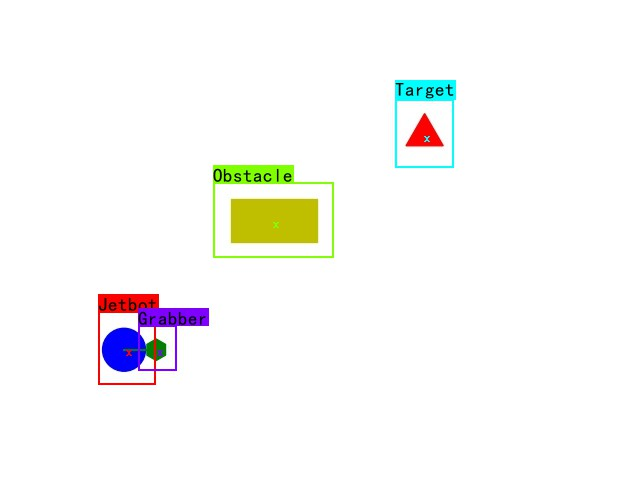

/**

* @ Author: Zion Deng  ziondeng@berkeley.edu
* @ Description: The conclusion of the whole project. Along with what you can do next.
  */

# what I have done:

## Build the framework for our Project

* A framework which uses a coordinate system on the basis of pixels.
* Compared with the coordinate system based on the real environment, this system is less reliable on the physical settings, especially the camera positioning. Also, the transformation process from physical environment to system environment is unnecessary when this framework is working.
* The collision detection algorithm will be easier for this framework since everything here can be regarded as points or set of points. You only need to judge the collision detection by checking if the point is in the set or not.
* A framework which uses real-time detection.
* Since model uncertainty is unavoidable, the real-time detection can eliminate the model uncertainty to the great extent.

## Simulation environment for system testing

* The final version of our project uses the Matplotlib library for simulation. The animation is smooth and the result is satisfying.
* Trials have been made for using the MuJoCo environment. Although the Jetbot in the environment can reach the target point, the movement is just like an SB. So I abandoned the MuJoCo environment in the enYOLd.

## YOLO-v3 detection

* Deployed YOLO-v3 deep learning neural network
* Changed the output so that the system can make use of the data and the same format

## Astar Path-finding algorithm

* Get to understand the core idea of the algorithm.
* Build the algorithm environment based on the results of the YOLO detection.
* Add margins based on the size of the Jetbot to the Obstacle so that the Jetbot itself can be regarded as a point.

## Simple control algorithm for Jetbot movement

* Every time the system get the trajectory that the Jetbot should move, the Jetbot will act accordingly.
* The idea is simple: Turn until the heading is within the region of the desired heading, then move forward.
* Horizon(see the blue line of the picture below) is introduced in the system and the desired heading is determined by the end point of the horizon.

## Simple simulation environment for Reinforcement Learning training

* I wrote a simple model for DQN training and testing.
* The major difference of my environment from other team members is that my environment uses the same data structure and setting as the system. Everything here is regarded as point or set of points and the collision detection is also the same as mentioned above.
* However, as we have found, the training is not satisfying enough and the accuracy is not always good(actually it is good only in some rare cases). So be careful unless you really want to use reinforcement learning.

# What to expect in the future:

## A faster deep learning neural network for object detection.

YOLO-v3 is not the most efficient network for object detection. Maybe you can use other algorithms like YOLO-tiny or faster RCNN. Check the efficiency and accuracy of the algorithm on JetsonNano.

## More efficient and robust control algorithms for Jetbot movement.

There should be members in your team whose track is robotics and autonomous systems. Use ideas from ME231 or ME290S for trajectory following. Algorithms like PID, MPC, LQR can be useful.

## Improvement for faster computation

The whole system should be working on the JetsonNano finally. In that case, the only remote device would be the camera. One thing to mention is that the Jetbot python environment is quite different from usual python environment(at least from what I know). Almost all the packages are installed in the ipython environment and can only be used in jupyter lab.
